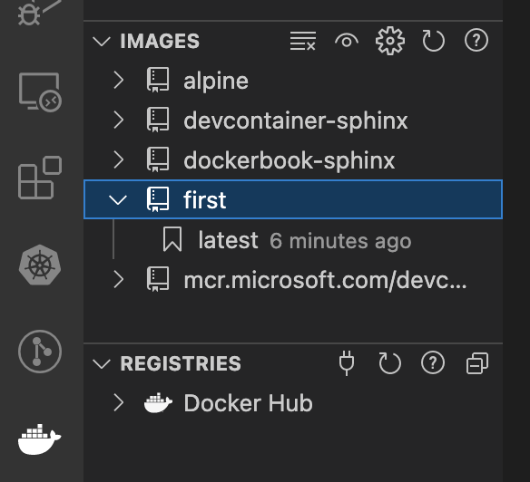
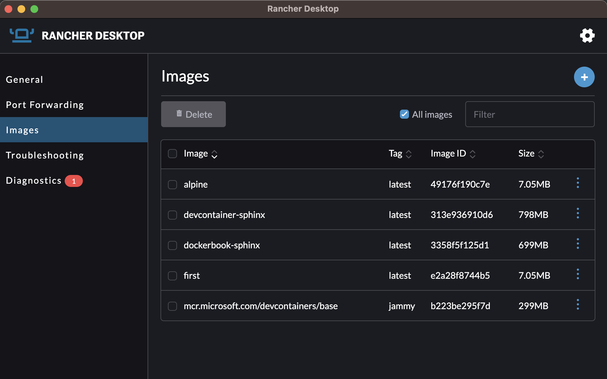

.. _build-image-first:

===============================================
簡単なイメージの作成
===============================================

簡単なイメージ作成を通して、イメージ作成と実行の流れをチェックしておきましょう。

まず、適当なディレクトリを用意してください。
ここでは、 `first` としておきます。

.. note::
    Dockerでは、イメージ内で使うデータや設定は特定のディレクトリ以下のファイル/ディレクトリを対象とし、作業の際にDockerシステムにアーカイブして転送します。
    そのため、他の用途で使っている(データのある)ディレクトリを使い回してしまうと、それらも一度アーカイブして転送することになるため、実行開始までの時間がすごく遅くなることもあります。
    必ず作業単位毎にディレクトリを作成して対応しましょう。

:file:`Dockerfile` の作成
=================================

まずは :file:`Dockerfile` です。このファイル(ファイル名重要重要)がDockerにおけるイメージ作成の定義ファイルとなっています。
別の名前でも可能ですが、いちいちファイル名指定が必要で面倒になるため、原則としてこのファイル名で作ってください。

.. literalinclude:: first/Dockerfile
    :caption: :file:`first/Dockerfile`
    :language: Dockerfile

イメージの作成
=================================

作成したら、イメージの作成を行います。 :file:`Dockerfile` の置いてあるディレクトリ(今回であれば :file:`first` ディレクトリ)上で端末を開いてください。
そしてコマンドを入力します。

.. code-block:: ps1
    :caption: イメージ作成(カレントディレクトリ)
    :emphasize-lines: 1

    PS> docker build -t first .  # 最後の引数が "." なので注意!
    Sending build context to Docker daemon  2.048kB
    Step 1/2 : FROM alpine
    latest: Pulling from library/alpine
    c158987b0551: Pull complete
    Digest: sha256:8914eb54f968791faf6a8638949e480fef81e697984fba772b3976835194c6d4
    Status: Downloaded newer image for alpine:latest
    ---> 49176f190c7e
    Step 2/2 : CMD echo 'Hello, World!'
    ---> Running in 0ab731b7cc25
    Removing intermediate container 0ab731b7cc25
    ---> e2a28f8744b5
    Successfully built e2a28f8744b5
    Successfully tagged first:latest

.. note::
    イメージ作成の際、必ず **どのディレクトリで作業をするのか** が必要です。
    :file:`Dockerfile` のあるディレクトリ上で作業している場合も、カレントディレクトリである `.` が必須となります。
    逆に言えば、場所を指定できればディレクトリの外からでも可能です。

    .. code-block:: ps1
        :caption: :file:`first` のひとつ親ディレクトリから操作する場合

        PS> docker build -t first first

イメージの存在確認
=================================

イメージの実行がうまくいってもいかなくても、とりあえずイメージが生成されたかについてのチェックをしておきましょう。

コマンドラインでのチェック
---------------------------------------

コマンドラインであれば、 :command:`docker` コマンドで普通に確認できます。

.. code-block:: ps1
    :caption: 正常にイメージが生成された場合
    :emphasize-lines: 3

    PS> docker image ls first
    REPOSITORY   TAG       IMAGE ID       CREATED         SIZE
    first        latest    e2a28f8744b5   3 minutes ago   7.05MB

存在していない場合は、イメージ名が出てきません。

.. code-block:: ps1
    :caption: イメージが生成されていない場合

    PS> docker image ls first
    REPOSITORY   TAG       IMAGE ID       CREATED         SIZE

    # ↑ イメージ名の行が出てこない

vscode上での確認
----------------------------

Docker拡張がインストールされていて、"Docker"ボタンが出ている場合は、そこからイメージの存在を確認できます。

    vscodeでのDockerイメージ一覧表示部分

その他のGUIでの確認
---------------------------------

- Docker Desktopを使っている場合、GUI上で確認できます
- Rancher Desktopを使っている場合も同様にGUI上で確認できます

    Rancher Desktop使用時のイメージ一覧UI

イメージの呼び出し
==================================

作成したイメージを呼び出して実行させてみましょう。

.. code-block:: ps1
    :caption: firstイメージを使ったコンテナ生成/実行

    PS> docker run --rm first
    Hello, World!

どうしてこうなった?
=============================

イメージを実行することで、コンテナが生成され、その中で出力(:code:`Hello, World!`)があったわけですが、どうしてこうなったのかをある程度認識しておきましょう。
そのためには、 :file:`Dockerfile` の再認識が必要です。

.. literalinclude:: first/Dockerfile
    :caption: :file:`first/Dockerfile`(再掲)
    :language: Dockerfile
    :linenos:

ベースイメージの取得(FROM)
---------------------------------------

イメージは完全なスクラッチ(= 空っぽ)状態から生成することも可能ですが、一般的には他のイメージをベースとします。
ベースとするイメージを `FROM` により取得します。
ここでは1行目にて、 `alipine` を選択しています、この `イメージ <https://hub.docker.com/_/alpine>`_ は `Alpine Linux <https://alpinelinux.org/>`_  というLinuxディストリビューションのものです。Alpine Linuxは、スローガンにあるとおり

Small
    フットプリントが(既存のメジャーディストリビューションに比べて)相当に小さい
Simple
    複雑な構造を持たない(Systemdとか)
Secure
    セキュリティに配慮している

を標榜するものとなっています。バージョン的なものは存在していますが、常時アップデートという感じで、常にどこかが更新された最新版が存在する感じとなっています。
バージョンを固定したい場合はタグを指定することで可能です(`alpine:3.17` など) [#ver]_ 。

.. note::

    より小さいものという意味では、busyboxを用いたイメージを使うことになりますが、組込レベルの小ささになるため、保守に向かない場合もあります。
    適度に操作可能で小さいという意味では、Alpineは重宝がられております。

とりあえずこれを下地にして、そこにアレンジを加えていこうという流れで構成されています。

コマンドの実行(CMD)
---------------------------------------

2行目の :code:`CMD` 行は、コマンドを呼び出して実行させるための行となっています。
:code:`CMD` 行はイメージ作成時には実行されず、 **生成されたコンテナの中で実行される** 予定のものを書きます。
そのため、イメージ内に存在するコマンドであることが条件ですが、存在するのであれば原則何でも実行可能です。

そこで今回は、 :command:`echo` コマンドを実行して、引数である文字列を出力させているという仕組みです。

:code:`CMD` 行は、コンテナ実行時に上書き(オーバーライド)可能な項目で、必要があれば任意のコマンドに置き換えることも可能です。
そこでちょっと試してみましょう。

.. code-block:: ps1
    :caption: コマンドラインの差し替え例(→ :command:`ls -x /`)

    PS> docker run --rm first ls -x /
    bin    dev    etc    home   lib    media  mnt    opt    proc   root   run
    sbin   srv    sys    tmp    usr    var

このように、イメージ名(`first`)指定の後にコマンドラインをそのまま渡せるようになっています。

以上2行で、イメージに対する構成がわかるようになっているのでした。

#. ベースイメージとして `alpine` (イメージ生成時の最新版)を利用してください
#. コンテナ生成後、 :command:`echo` を実行してください

.. rubric:: 脚注

.. [#ver] 常時どこかが更新される状況のため、むしろ自分たちの成果物がその時の最新のAlpineで動くことを検証して進める方がセキュリティに対応していることに近づきます。
